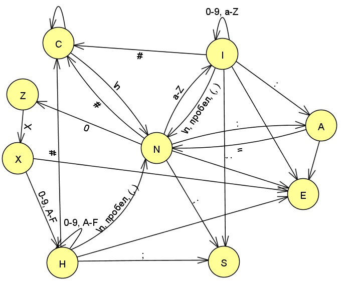
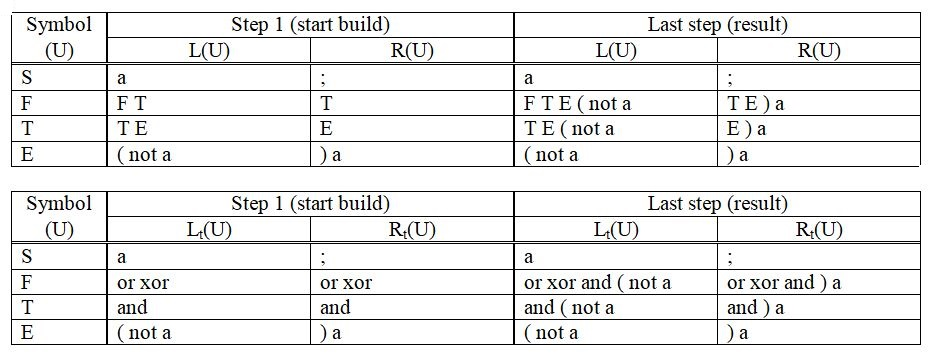
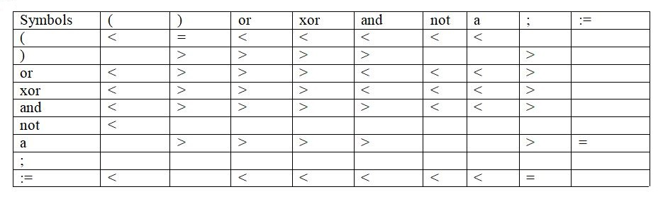
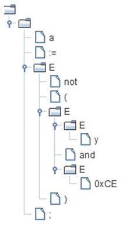

`Pie` - compiler for a simple pseudo language. 

The language has several rules:
1. Contains boolean expressions separated by ';' (point with
   comma).
2. Boolean expressions are composed of identifiers, hexadecimal numbers,
   assignment signs (: =), or, xor, and, not operation signs, and round brackets.
3. Used comment type - #

`Pie` has three parts:

1. Lexical analyzer
2. Syntactical analyzer
3. Object Code Generator and Optimizer (Assembler)

## _Lexical analyzer_

The lexical analyzer is based on a finite - state machine:

_G_ = ({N, S, C, I, A, Z, X, H, E}, {0...9, a...F,(,), ′ # ′ , ; , =, :}, 𝛿, N, {S})   
_N_ - start state  
_S_ - end state  
_C_ - comment input state  
_I_ - identifier input state   
_A_ - assignment statement input state  
_Z_ - 0 input state  
_X_ - x input state  
_H_ - hexadecimal input state  
_E_ - error state (entered an invalid character)  

   
<a>Test</a>

   

      <b>---- <tt>Input</tt> ----</b>  
      a := x and (0x09 xor z or 0xAF);   
      <b>---- <tt>Debugging</tt> ----</b>  
      currentStateN a  
      currentStateI  
      currentStateN :  
      currentStateA =  
      currentStateN  
      currentStateN x  
      currentStateI  
      currentStateN a  
      currentStateI n  
      currentStateI d  
      currentStateI  
      currentStateN (  
      currentStateN 0  
      currentStateZ x  
      currentStateX 0  
      currentStateH 9  
      currentStateH  
      currentStateN x  
      currentStateI o  
      currentStateI r  
      currentStateI  
      currentStateN z  
      currentStateI  
      currentStateN o  
      currentStateI r  
      currentStateI  
      currentStateN 0  
      currentStateZ x  
      currentStateX A  
      currentStateH F  
      currentStateH )  
      currentStateN ;   
      <b>---- <tt>Token table</tt> ----</b>  
   <table>
      <tr>
         <td align="right">ID</td>
         <td align="left">a</td>
      </tr>
      <tr>
         <td align="right">ASSIGNMENT</td>
         <td align="left">:=</td>
      </tr>
      <tr>
         <td align="right">ID</td>
         <td align="left">x</td>
      </tr>
      <tr>
         <td align="right">KEYWORD</td>
         <td align="left">and</td>
      </tr>
      <tr>
         <td align="right">BRACE</td>
         <td align="left">(</td>
      </tr>
      <tr>
         <td align="right">HEX</td>
         <td align="left">0x09</td>
      </tr>
      <tr>
         <td align="right">KEYWORD</td>
         <td align="left">xor</td>
      </tr>
      <tr>
         <td align="right">ID</td>
         <td align="left">z</td>
      </tr>
      <tr>
         <td align="right">KEYWORD</td>
         <td align="left">or</td>
      </tr>
      <tr>
         <td align="right">HEX</td>
         <td align="left">0xAF</td>
      </tr>
      <tr>
         <td align="right">BRACE</td>
         <td align="left">)</td>
      </tr>
      <tr>
         <td align="right">END_STATEMENT</td>
         <td align="left">;</td>
      </tr>
   </table>
   
 

## _Syntactical analyzer_

1. There are preset language rules:

S -> a := F; (Rule 1)    
F -> F or T | F xor T | T (Rules 2,3,4)   
T -> T and E | E (Rules 5,6)  	
E -> (F) | not (F) | a (Rules 7,8,9)  
G({S,F,T,E},{a, := , ; , or, xor, and, not, (, )},P,S)  

2. The set of right and left symbols:

3. The precedence table:

4. Minimizing rules:   

E -> a := E; (Rule 1)   
E -> E or E | E xor E | E (Rules 2,3,4)   
E -> E and E | E (Rules 5,6)  
E -> (E) | not (E) | a (Rules 7,8,9)

 
    
<a>Test</a>

    

            <b>---- <tt>Input</tt> ----</b>  
            a := not(y and 0xCE);  
            <b>---- <tt>Building the output tree</tt> ----</b>

 

        
 

        <b>---- <tt>Debugging</tt> ----</b>  
Line - [a := a and ( a xor a or a ) ;]  
Memory - [] 
Action - Transfer

Line - [:= a and ( a xor a or a ) ;]  
Memory - [a] 
Compare... a = :=
Action - Transfer

Line - [a and ( a xor a or a ) ;]  
Memory - [a :=] 
Compare... := < a
Action - Transfer

Line - [and ( a xor a or a ) ;]  
Memory - [a := a] 
Compare... a > and
Action - Convolution 9

Line - [and ( a xor a or a ) ;]    
Memory - [a := E] 
Compare... := < and
Action - Transfer

Line - [( a xor a or a ) ;]    
Memory - [a := E and] 
Compare... and < (
Action - Transfer

Line - [a xor a or a ) ;]    
Memory - [a := E and (] 
Compare... ( < a
Action - Transfer

Line - [xor a or a ) ;]    
Memory - [a := E and ( a] 
Compare... a > xor
Action - Convolution 9

Line - [xor a or a ) ;]    
Memory - [a := E and ( E] 
Compare... ( < xor
Action - Transfer

Line - [a or a ) ;]    
Memory - [a := E and ( E xor] 
Compare... xor < a
Action - Transfer

Line - [or a ) ;]    
Memory - [a := E and ( E xor a] 
Compare... a > or
Action - Convolution 9

Line - [or a ) ;]    
Memory - [a := E and ( E xor E] 
Compare... xor > or
Action - Convolution 3

Line - [or a ) ;]    
Memory - [a := E and ( E] 
Compare... ( < or
Action - Transfer

Line - [a ) ;]    
Memory - [a := E and ( E or] 
Compare... or < a
Action - Transfer

Line - [) ;]    
Memory - [a := E and ( E or a] 
Compare... a > )
Action - Convolution 9

Line - [) ;]    
Memory - [a := E and ( E or E] 
Compare... or > )
Action - Convolution 2

Line - [) ;]    
Memory - [a := E and ( E] 
Compare... ( = )
Action - Transfer

Line - [;]    
Memory - [a := E and ( E )] 
Compare... ) > ;
Action - Convolution 7

Line - [;]    
Memory - [a := E and E] 
Compare... and > ;
Action - Convolution 5

Line - [;]    
Memory - [a := E] 
Compare... := = ;
Action - Transfer

Line - []    
Memory - [a := E ;] 
Action - Convolution 1

Line - []    
Memory - [E] 

## _Object Code Generator and Optimizer_

Generation based on triads.

 
    
<a>Test</a>

Triads: 
     
  1: xor (0x09, z) 
  2: or (^1, 0xAF) 
  3: and (x, ^2) 
  4: := (a, ^3) 
  
Code: 

MOV AX, 0x09 
MOV BX, z 
XOR AX, BX 
PUSH AX 

POP AX 
MOV BX, 0xAF 
OR AX, BX 
PUSH AX 

POP BX 
MOV AX, x 
AND AX, BX 
PUSH AX 

POP AX 
MOV a, AX 
      
Collapsing triads: 
        
Step 1: 
        
1: xor (0x09, z) 
2: or (^1, 0xAF) 
3: and (x, ^2) 
4: := (a, ^3) 
        
Step 2: 
        
1: xor (0x09, z) 
2: or (^1, 0xAF) 
3: and (x, ^2) 
4: := (a, ^3) 
        
Optimized code: 
        
MOV AX, 0x09 
MOV BX, z 
XOR AX, BX 
        
MOV BX, 0xAF 
OR AX, BX 
        
MOVE BX, AX 
MOV AX, x 
AND AX, BX 
        
MOV a, AX 

